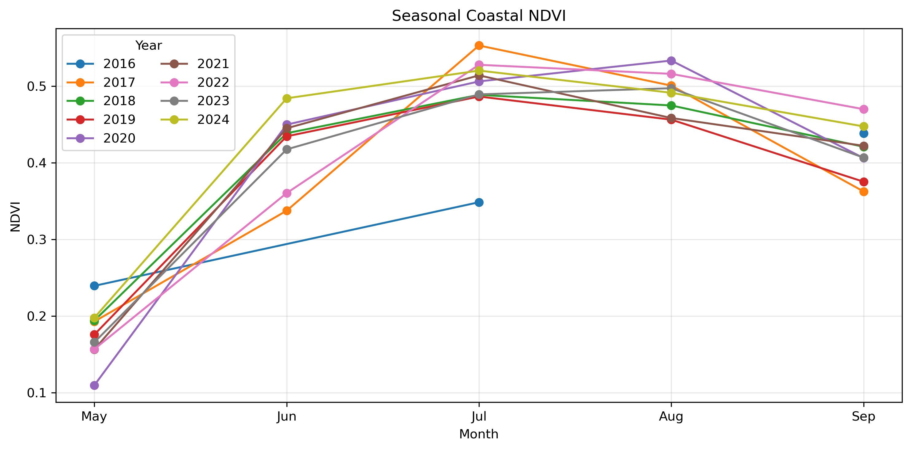
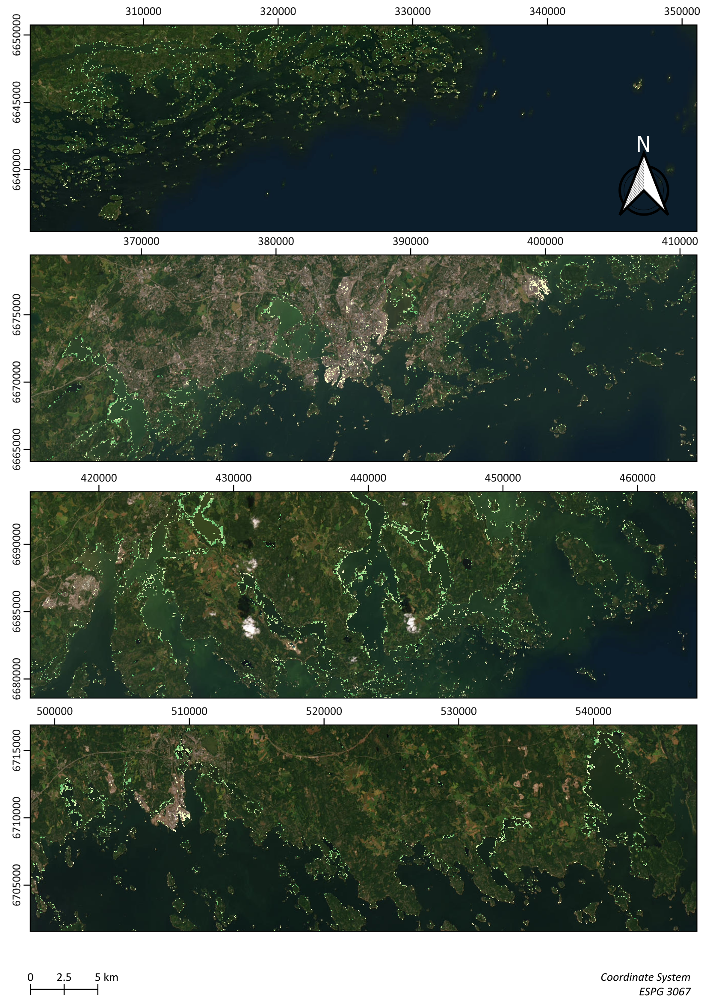
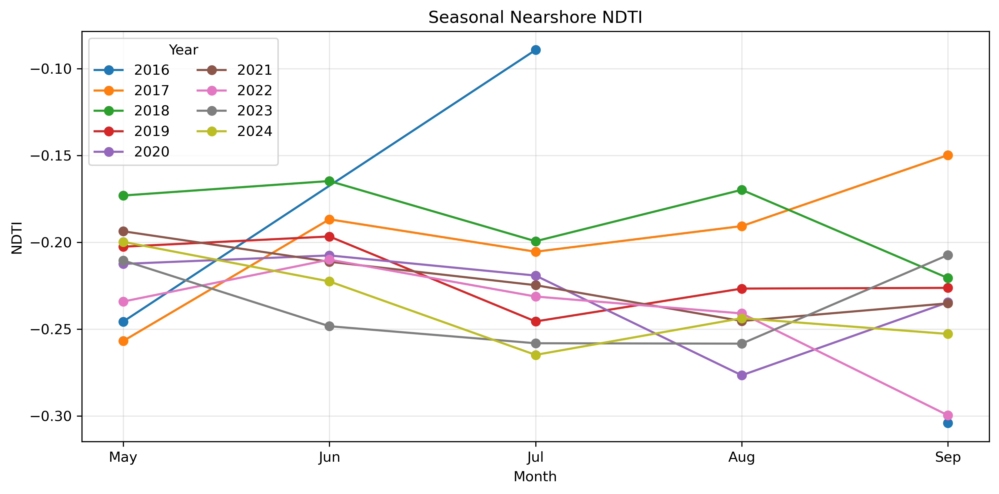
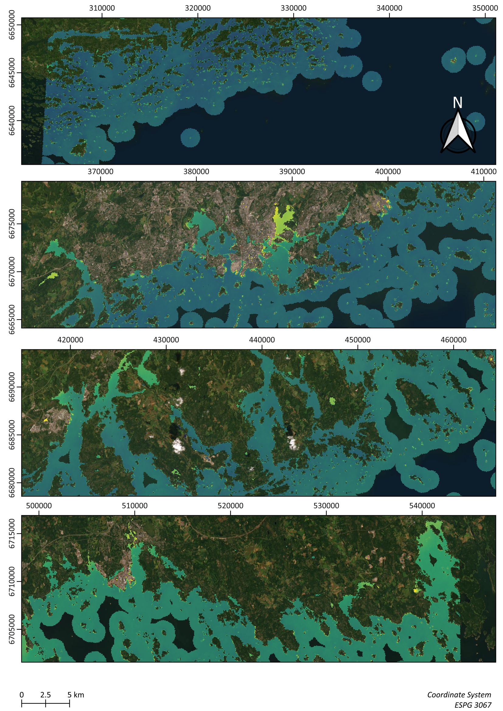
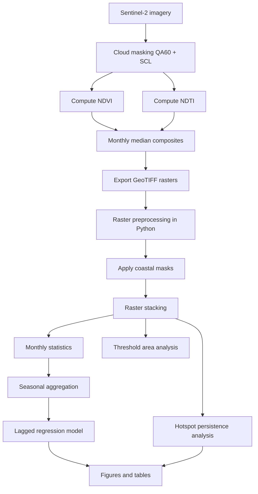
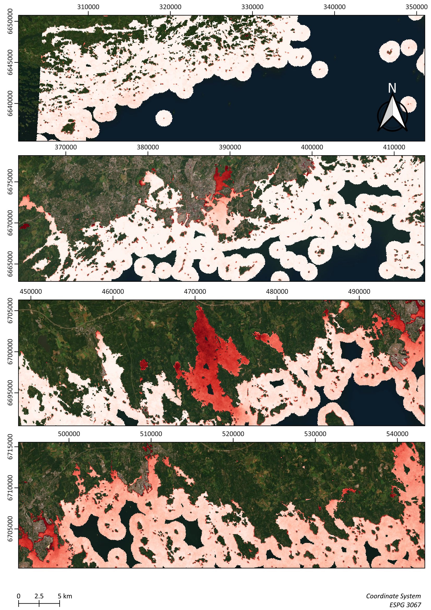

# 1) Introduction
This project explores the use of satellite remote sensing to monitor coastal environmental conditions in the Baltic Sea. the workflow focuses on two spectral indicators: the Normalized Difference Vegetation Index (NDVI) and the Normalized Difference Turbidity Index (NDTI). NDVI is used to detect coastal vegetation and potential floating algal biomass, while NDTI serves as a proxy for suspended sediments and water turbidity.
The objective of this project is to develop a reproducible satellite-based workflow for monitoring coastal environmental dynamics in the Gulf of Finland using NDVI and NDTI derived from Sentinel-2 imagery.

Specifically, the project aims to: investigate the relationship between turbidity and vegetation dynamics, including a lagged regression where NDVI responds to turbidity in the previous month and identify persistent spatial hotspots of high NDVI and NDTI through multi-year percentile-based persistence analysis.

# 2) Methods

## 2.1) Study Area

The analysis focuses on the **Gulf of Finland**, located in the eastern Baltic Sea. This region is characterized by strong land–sea interactions driven by river discharge, sediment transport, coastal vegetation dynamics, and seasonal phytoplankton blooms. These processes produce detectable spectral signals in optical satellite imagery.

The study domain is defined as a rectangular region:

$$
23.5^\circ E \leq \lambda \leq 30.28^\circ E
$$

$$
59.4^\circ N \leq \phi \leq 60.7^\circ N
$$

To analyze coastal processes separately on land and water, two spatial domains are defined:

- **Land coastal buffer:** 1 km inland from shoreline  
- **Water coastal buffer:** 1 km offshore from shoreline  

The land buffer is used for vegetation analysis (NDVI), while the marine buffer is used to analyze turbidity signals (NDTI).

## 2.2) Satellite Data

Satellite observations are derived from **Sentinel-2 Surface Reflectance imagery**.

Key characteristics:

| Parameter | Value |
|-----------|------|
| Sensor | Sentinel-2 MSI |
| Spatial resolution | 10–20 m |
| Temporal revisit | ~5 days |
| Data product | Surface reflectance |

The analysis uses the **COPERNICUS/S2_SR_HARMONIZED** dataset within Google Earth Engine.

Surface reflectance values represent the proportion of incoming solar radiation reflected by the Earth’s surface.

## 2.3) Normalized Difference Vegetation Index (NDVI)

NDVI is used to detect vegetation biomass and potential floating algae.

$$
NDVI = \frac{\rho_{NIR} - \rho_{Red}}{\rho_{NIR} + \rho_{Red}}
$$

where

- $$\rho_{NIR}$$ = reflectance in Sentinel-2 band B8  
- $$\rho_{Red}$$ = reflectance in band B4

NDVI values range between −1 and 1.

Typical interpretation:

| NDVI | Interpretation |
|------|---------------|
| < 0 | Water |
| 0 – 0.2 | Bare surface |
| 0.2 – 0.4 | Sparse vegetation |
| > 0.4 | Dense vegetation |

Pixels with

$$
NDVI \ge 0.40
$$

are interpreted as **significant vegetation or algal biomass**.

The average coastal NDVI is presented below:
<table>
  <tr>
    <td width="55%" valign="top">
        
      
    </td>
    <td width="45%" valign="top">
      
    </td>
  </tr>
</table>

## 2.4) Normalized Difference Turbidity Index (NDTI)

NDTI is used as a proxy for suspended sediments and turbidity in coastal waters.

$$
NDTI = \frac{\rho_{Red} - \rho_{Green}}{\rho_{Red} + \rho_{Green}}
$$

where

- $$\rho_{Red}$$ = reflectance in Sentinel-2 band B4  
- $$\rho_{Green}$$ = reflectance in band B3

Higher NDTI values correspond to increased backscatter from suspended particles in the water column.

Pixels exceeding

$$
NDTI \ge 0.10
$$

are interpreted as **high turbidity conditions**.

The average NDTI is presented below:
<table>
  <tr>
    <td width="55%" valign="top">
        
      
    </td>
    <td width="45%" valign="top">
      
    </td>
  </tr>
</table>

## 2.5) Lagged Regression Model

To investigate interactions between turbidity and vegetation signals, a lagged regression model is estimated.

The model evaluates whether turbidity conditions in the previous month influence vegetation signals.

$$
NDVI_t =
\beta_0 +
\beta_1 NDTI_{t-1} +
\beta_2 NDTI_t^2 +
\epsilon_t
$$

where

- $$NDVI_t$$ = vegetation signal at time t  
- $$NDTI_{t-1}$$ = turbidity signal in previous month  
- $$\epsilon_t$$ = residual error

The model is estimated using **ordinary least squares (OLS)**.

## 2.6) Hotspot Persistence Analysis

Persistent environmental signals are identified using percentile-based hotspot detection.

### Percentile threshold

$$
T_{80} = P_{80}(X)
$$

where $$P_{80}$$ is the 80th percentile of index values.

---

### Hotspot classification

$$
H_t(x,y) =
\begin{cases}
1 & X_t(x,y) \ge T_{80} \\
0 & X_t(x,y) < T_{80}
\end{cases}
$$

---

### Persistence calculation

Hotspot persistence is defined as

$$
P(x,y) = \sum_{t=1}^{n} H_t(x,y)
$$

Higher persistence values indicate locations where vegetation or turbidity signals occur repeatedly over time.

---

## 2.7) Workflow

# 3) Regression Result
## Regression Results

| Metric | Value |
|------|------|
| Observations | 32 |
| R² | 0.311 |
| Adjusted R² | 0.263 |
| F-statistic | 6.539 |
| Model p-value | 0.00453 |
| AIC | -102.5 |

---

### Coefficients

| Variable | Coefficient | Std. Error | t-value | p-value |
|--------|------------|-----------|--------|--------|
| Intercept | 0.5380 | 0.064 | 8.365 | < 0.001 |
| NDTI (lag 1) | 0.8685 | 0.325 | 2.670 | 0.012 |
| NDTI² | 2.1814 | 0.645 | 3.381 | 0.002 |

---

## Model Diagnostics

| Test | Result | Interpretation |
|-----|-------|---------------|
| Durbin–Watson | 2.13 | No autocorrelation |
| Jarque–Bera p-value | 0.540 | Residuals approximately normal |
| Condition Number | 82.8 | No severe multicollinearity |

---
The model has a statistically significant nonlinear relationship between turbidity and vegetation. Both linear $NDTI_{t-1}$ and quadratic $NDTI_t^2$ terms are significant
Coastal vegetation productivity is influenced by turbidity, but the effect is not linear. Instead, turbidity interacts with vegetation through multiple mechanisms such as sediment transport, nutrient availability, and light attenuation.

This nonlinear relationship likely reflects competing processes:

- **Low turbidity** → better light penetration → supports vegetation
- **Moderate turbidity** → may introduce nutrients → enhances productivity
- **High turbidity** → reduces light availability → limits growth

# 4) Hotspot Analysis

  

Persistent hotspots are concentrated along nearshore zones and archipelagic environments. The persistence maps show a clear coastal-to-offshore gradient:
- High persistence in shallow coastal waters  
- Rapid decay toward open sea  
This reflects a controlling processes of the area:

| Zone | Dominant Processes | Expected Dynamics |
|------|------------------|------------------|
| Nearshore | Nutrient loading, resuspension | Frequent hotspot activation |
| Archipelago | Retention, low flushing | Persistent hotspots |
| Offshore | Mixing, dilution | Weak or absent hotspots |

  

Hotspots are spatially clustered at scales of several kilometers, particularly in:

- Semi-enclosed bays  
- Urban-influenced coastal regions  
- Transition zones between land and open water  

These clusters correspond to **hydrodynamic retention zones**, where:

- Water residence time is high  
- Nutrient accumulation is enhanced  
